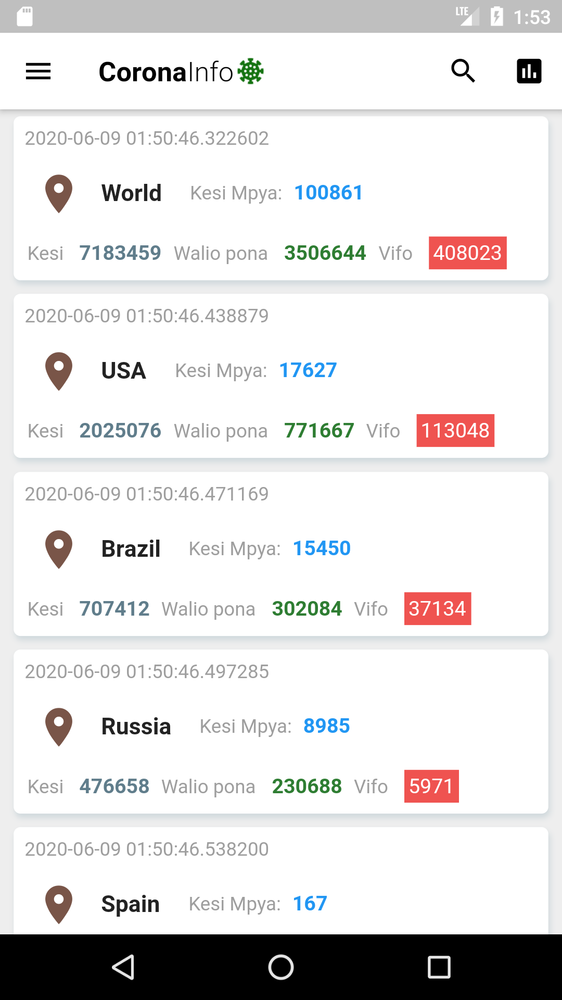
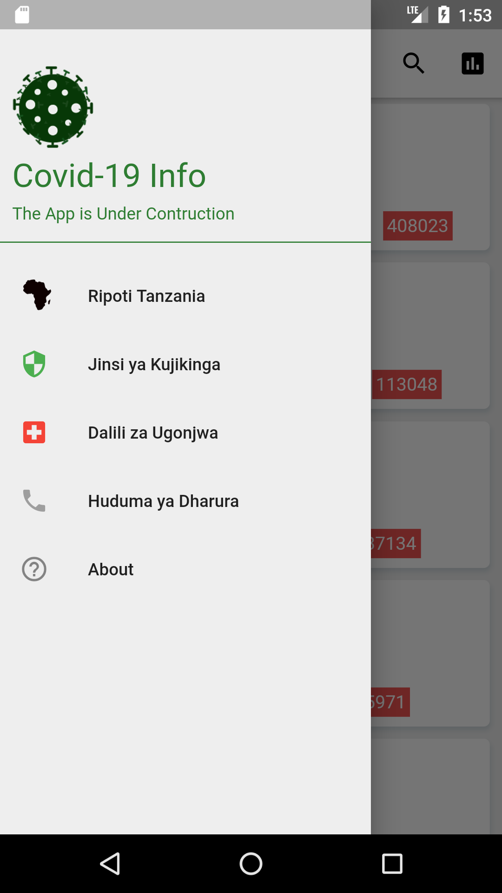

# Coronainfo application

### The App provide the information all over the :earth_asia: word about Corona Virus (COVID-19)

Show some love :smiley: by hit :point_right: Star :star: :star: :star:
## Created by 
[Josiah Mpokera](https://github.com/Josiahmpokera) | [Instagram](https://www.instagram.com/josiah__yesayah/) | [Twitter](https://twitter.com/Josiah_dev)

## Screenshot
 

Your can test this app to your **mashine..** :stuck_out_tongue_winking_eye: :stuck_out_tongue_winking_eye:

:warning: :warning: :warning: **NoMoreBugs** :laughing: :laughing:

If you want to get started with Flutter, don't waste a time 
[Flutter Documentation](https://flutter.dev/docs),

:heart::heart::heart: **We** **love** **to** **Code**